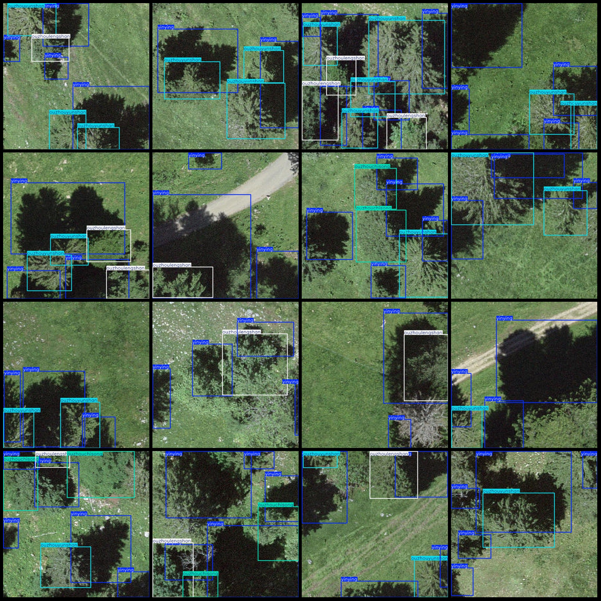
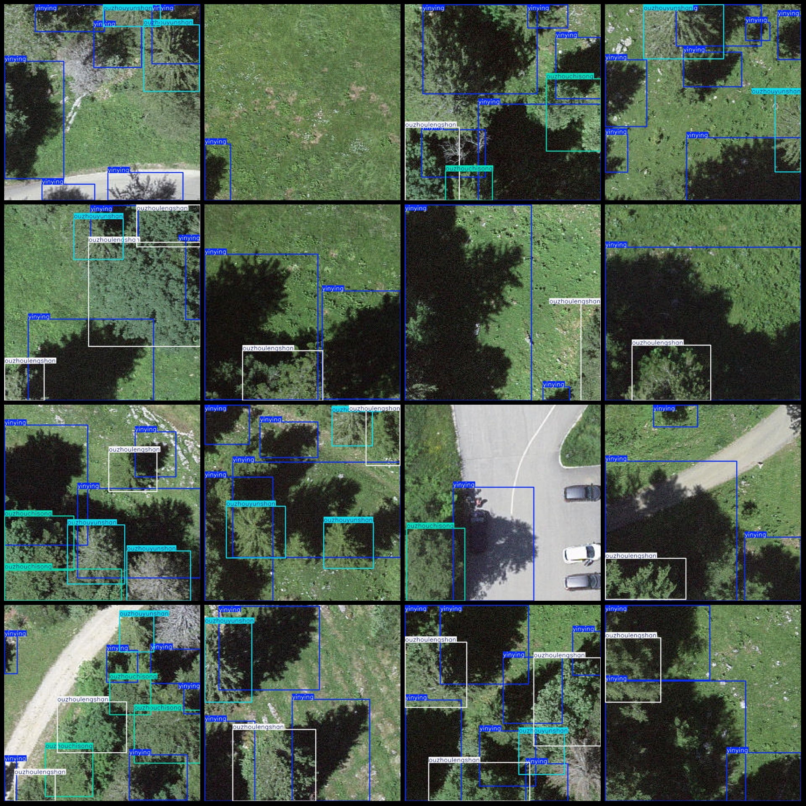

# Drone Perspective Smart Forestry Pascal VOC+YOLO Dataset: 200 Images in 4 Categories

Dataset formats: Pascal VOC format + YOLO format (txt file without split path, only containing jpg images and corresponding VOC format xml files and YOLO format txt files)
Number of image files (jpg): 200
Number of annotation files (xml): 200
Number of annotation files (txt): 200
Number of annotation categories: 4
Annotation category names: ["ouzhouchisong", "ouzhoulengshan", "ouzhouyunshan", "yingying"]
Corresponding Chinese category names: ["European larch", "European spruce", "European fir", "shadow"]
Box count for each category:
- ouzhouchisong box count = 55
- ouzhoulengshan box count = 169
- ouzhouyunshan box count = 219
- yinying box count = 690
Total box count: 1133
Number of images per category:
- ouzhouchisong images per category = 32
- ouzhoulengshan images per category = 111
- ouzhouyunshan images per category = 104
- yinying images per category = 200
Image resolution: 640x640
Annotation tool used: labelImg
Annotation rules: draw boxes around the categories
Important Note: The dataset does not have a split into training, validation, and test sets, so users must manually split it.
Special declaration: This dataset does not guarantee any accuracy of the trained models or weight files.
Image preview:
## Images

Here is a pay link on Stripe ( https://buy.stripe.com/3cs8yP7sY87d0vu9AB ). Please contact me lonlonago@foxmail.com after funding $89, and I will send you a complete data files , thank you!

